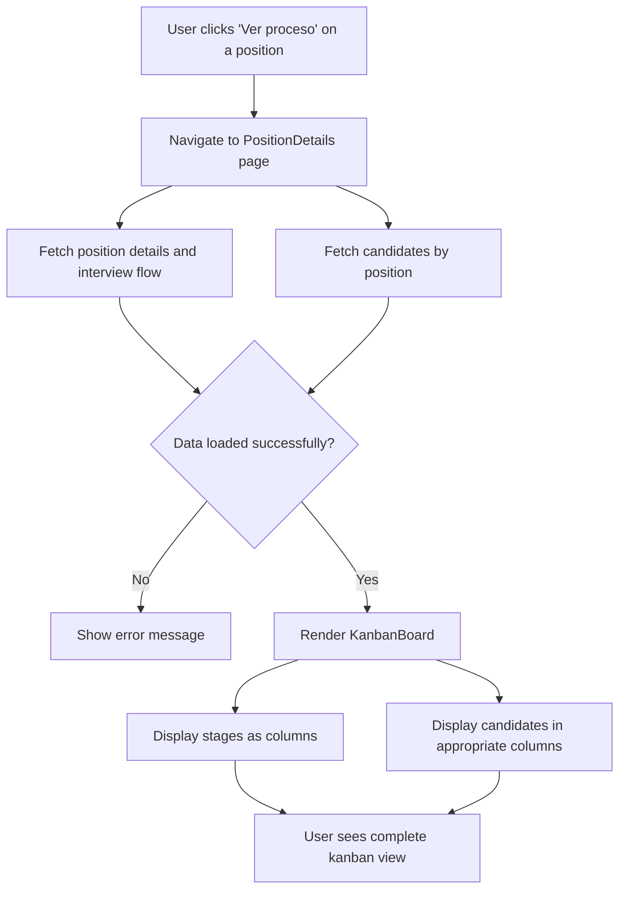

# User Story 1: View Position Details with Kanban Board

## Title
As a recruiter, I want to view a job position's details with a kanban board displaying all candidates and their current interview stages so that I can manage the hiring process efficiently.

## Description
A recruiter should be able to navigate to a position details page that displays:
- The job position title with a back button to return to the positions list
- A kanban board with columns representing each stage in the hiring process
- Candidate cards in each column showing the candidate's name and score
- Visual indicators for candidate information

The page should fetch position details, interview flow stages, and candidates from the backend API and present them in an organized, easy-to-read kanban format.

## Acceptance Criteria
1. **AC1**: The position details page displays the job position title and includes a functional back button that navigates to the positions list
2. **AC2**: The kanban board displays all interview stages as columns, sorted by `orderIndex` from the interview flow
3. **AC3**: Each column header shows the stage name and the number of candidates in that stage
4. **AC4**: Candidate cards are displayed in the appropriate column based on their `currentInterviewStep`
5. **AC5**: Each candidate card displays:
   - Full name (firstName + lastName)
   - Score (if available, otherwise show N/A or 0)
   - Visual styling that clearly shows it as a draggable card
6. **AC6**: Empty stages show an empty state message ("No candidates")
7. **AC7**: The page loads data from the backend API endpoints:
   - GET /position/:id/interviewflow
   - GET /position/:id/candidates
8. **AC8**: Error handling is implemented for failed API calls with appropriate user feedback
9. **AC9**: Loading states are shown while fetching data

## Tasks
- Task 1-1: Set up React routing for the position details page
- Task 1-2: Create API service methods for fetching position and candidate data
- Task 1-3: Create the KanbanBoard component with column structure
- Task 1-4: Create the CandidateCard component
- Task 1-5: Create the PositionDetails page component
- Task 1-6: Implement responsive design and styling
- Task 1-7: Add loading and error states
- Task 1-8: Write unit tests for the component
- Task 1-9: Write integration tests for data fetching

## Flow Diagram

## Notes
- This user story focuses on the **read-only** view of the kanban board
- Drag and drop functionality is covered in User Story 2
- The component should be optimized for performance when dealing with large numbers of candidates
