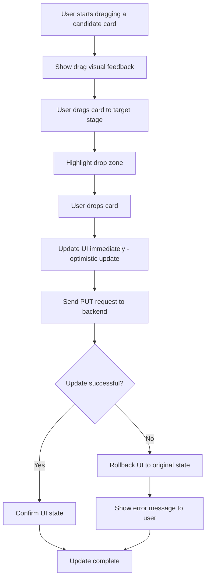

# User Story 2: Update Candidate Stage via Drag and Drop

## Title
As a recruiter, I want to update a candidate's interview stage by dragging and dropping their card between columns on the kanban board so that I can quickly advance candidates through the hiring process.

## Description
A recruiter should be able to drag a candidate card from one stage column to another stage column. This action should:
- Update the candidate's `currentInterviewStep` in the backend database
- Reflect the change immediately on the UI
- Provide visual feedback during the drag operation
- Handle potential errors gracefully

The drag and drop implementation should use a library like `react-beautiful-dnd` to provide smooth, accessible interactions.

## Acceptance Criteria
1. **AC1**: Candidate cards are draggable and show visual feedback (cursor change, opacity change) when hovering
2. **AC2**: Stages are drop zones that accept candidate cards
3. **AC3**: When a card is dropped onto a new stage column:
   - The card moves to the new column
   - The candidate's stage is updated in the backend via PUT /candidates/:id/stage
   - The request includes `applicationId` and `currentInterviewStep`
4. **AC4**: The UI is updated immediately after a successful drop (optimistic update)
5. **AC5**: If the backend update fails, the card returns to its original position and an error message is displayed
6. **AC6**: During the drag operation, the dragged card shows a visual indicator (e.g., opacity or shadow change)
7. **AC7**: Disabled candidates (if any) cannot be dragged
8. **AC8**: Multiple candidates can be in the same stage
9. **AC9**: The order of candidates within a stage is maintained

## Tasks
- Task 2-1: Install and configure react-beautiful-dnd library
- Task 2-2: Implement drag and drop handlers in KanbanBoard component
- Task 2-3: Create API service method to update candidate stage
- Task 2-4: Implement optimistic UI updates
- Task 2-5: Implement error handling and rollback mechanism
- Task 2-6: Add visual feedback during drag operations
- Task 2-7: Add loading indicator during API call
- Task 2-8: Ensure accessibility (keyboard navigation)
- Task 2-9: Write unit tests for drag and drop logic
- Task 2-10: Write integration tests for API updates
- Task 2-11: Test edge cases (rapid clicks, network errors)

## Flow Diagram

## Notes
- Uses optimistic updates to provide instant feedback to users
- Includes comprehensive error handling and rollback mechanism
- Must maintain data consistency between frontend and backend
- Should handle race conditions if multiple users are editing simultaneously (future enhancement)
