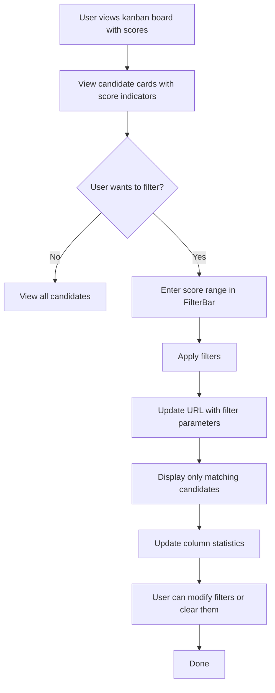

# User Story 3: Candidate Score Display and Filtering

**Status: ✅ COMPLETED (100%)**

## Title
As a recruiter, I want to see candidate scores on the kanban board and optionally filter candidates by score range so that I can quickly identify high-potential candidates.

## Description
Enhance the kanban board display to include candidate score information and provide filtering capabilities:
- Display the candidate's average score (calculated from interview results) on each card
- Show score with appropriate visual indicators (color coding)
- Provide a score filter that allows filtering candidates by score range
- Show aggregate statistics (e.g., number of candidates, average score per stage)

This helps recruiters quickly identify the best candidates at each stage of the process.

## Acceptance Criteria
1. **AC1**: Each candidate card displays:
   - Candidate name and surname
   - Average score (calculated from all interviews)
   - Visual score indicator (e.g., color: red for low, yellow for medium, green for high)
2. **AC2**: Score is displayed with one decimal place or as "N/A" if no interviews have been conducted
3. **AC3**: A filter section above the kanban board allows:
   - Entering a minimum score (e.g., >= 3.0)
   - Entering a maximum score (e.g., <= 5.0)
   - A "Clear filters" button to reset
4. **AC4**: When filters are applied, only candidates matching the score criteria are displayed
5. **AC5**: Filter state is persisted in URL query parameters for bookmarking/sharing
6. **AC6**: Column headers show:
   - Stage name
   - Total number of candidates (before filtering)
   - Number of candidates matching current filters (in parentheses)
7. **AC7**: Filtering updates are immediate (client-side) without additional API calls
8. **AC8**: Visual feedback shows when filters are active

## Tasks
- Task 3-1: Add score calculation logic in API responses
- Task 3-2: Create FilterBar component with score range inputs
- Task 3-3: Implement filtering logic in KanbanBoard component
- Task 3-4: Add color-coded score indicators to CandidateCard
- Task 3-5: Implement URL query parameter persistence
- Task 3-6: Update column headers with statistics
- Task 3-7: Add clear filters button functionality
- Task 3-8: Write unit tests for filtering logic
- Task 3-9: Write tests for score display formatting
- Task 3-10: Implement responsive design for filter bar

## Flow Diagram

## Notes
- Filtering is performed on the frontend for performance
- Score calculation should follow the backend's existing algorithm
- Color coding should be configurable and visually accessible
- Consider future enhancement: export filtered candidate list
