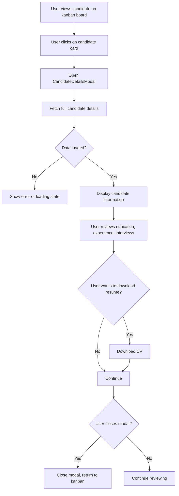

# User Story 4: Candidate Details Modal

## Title
As a recruiter, I want to click on a candidate card to view their full details including resume and interview history so that I can make informed decisions about advancing them in the hiring process.

## Description
Add a modal dialog that displays comprehensive candidate information when a candidate card is clicked:
- Personal information (name, email, phone, address)
- Education history
- Work experience
- Resume/CV download link
- Interview history (date, stage, score, notes)
- Current application status

This allows recruiters to quickly review candidate details without leaving the kanban board view.

## Acceptance Criteria
1. **AC1**: Clicking on a candidate card opens a modal dialog with candidate details
2. **AC2**: The modal displays:
   - Candidate name, email, phone, and address
   - Education history (institution, title, dates)
   - Work experience (company, position, description, dates)
   - CV/Resume with download link
   - Interview history (stage name, interview date, score, interviewer, notes)
   - Current application status
3. **AC3**: A close button (X) in the top-right corner closes the modal
4. **AC4**: Clicking outside the modal closes it
5. **AC5**: The modal is scrollable if content exceeds viewport height
6. **AC6**: Resume/CV is downloadable via a download link
7. **AC7**: Interview history is displayed in chronological order
8. **AC8**: If some information is missing, display "N/A" or empty state
9. **AC9**: Modal content is fetched via GET /candidates/:id endpoint

## Tasks
- Task 4-1: Create CandidateDetailsModal component
- Task 4-2: Add click handler to CandidateCard component
- Task 4-3: Implement modal open/close functionality
- Task 4-4: Create API service method to fetch full candidate details
- Task 4-5: Display candidate personal information
- Task 4-6: Display education history section
- Task 4-7: Display work experience section
- Task 4-8: Add resume download functionality
- Task 4-9: Display interview history section
- Task 4-10: Implement responsive modal styling
- Task 4-11: Add loading and error states for modal content
- Task 4-12: Write unit tests for modal component
- Task 4-13: Write tests for data display and formatting

## Flow Diagram

## Notes
- Modal should be accessible (ARIA attributes, keyboard navigation)
- Loading states should be shown while fetching candidate details
- Resume download should be secure and not expose file paths to users
- Consider pagination if interview history is very long
